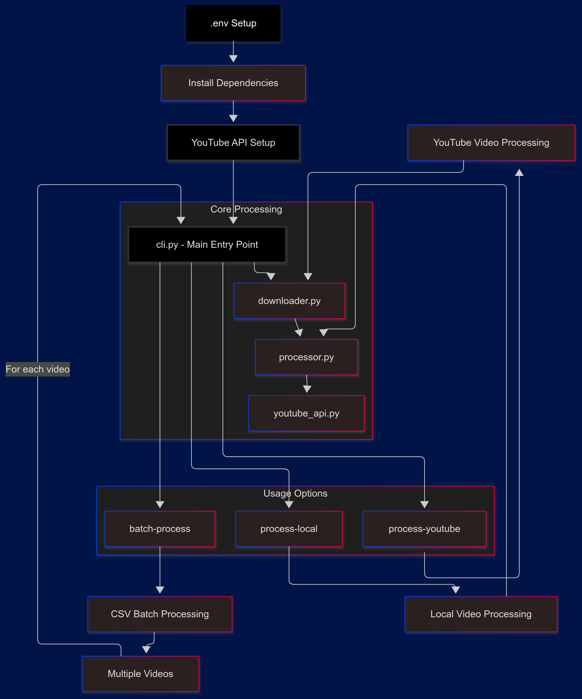

# YouTube Video Automation

[](https://www.python.org/downloads/)
[](https://ffmpeg.org/)
[](https://developers.google.com/youtube/v3)
[](https://github.com/yt-dlp/yt-dlp)
[](https://streamlit.io)
[](https://docs.pydantic.dev/)
[](https://opensource.org/licenses/MIT)

🎥 Professional-grade automation for YouTube content creators. Process, enhance, and schedule your videos with ease.

## 🏗️ Architecture



## ✨ Features

### Core Capabilities

- 🎬 Process both local videos and YouTube content
- 🔄 Add professional end screens automatically
- 📅 Schedule uploads with precise timing
- 📊 Batch process multiple videos
- 🖼️ Custom thumbnail processing
- 🏷️ Rich metadata management

### Creator Tools

- 📋 Batch upload via spreadsheet
- 🎮 Gaming-specific templates
- 📚 Tutorial series automation
- 🎙️ Podcast/Interview templates
- 📱 Vlog content management

### Technical Features

- 🔒 Secure OAuth2.0 authentication
- 🛠️ FFmpeg video processing
- 📝 Comprehensive logging
- ⚡ Efficient local processing
- 🔄 Automatic retry handling

## 🚀 Quick Start

### For Content Creators

👉 [See our Content Creator Guide](https://github.com/dasdatasensei/YouTubeVideoAutomation/blob/main/docs/content_creator_guide.md)

- Simple setup instructions
- Video upload guide
- Batch processing templates
- Best practices

### For Developers

👉 [See our Developer Guide](https://github.com/dasdatasensei/YouTubeVideoAutomation/blob/main/docs/developer_guide.md)

- Technical setup
- API documentation
- Contribution guidelines
- Architecture details

## 📖 Documentation

### User Guides

- [Getting Started](https://github.com/dasdatasensei/YouTubeVideoAutomation/blob/main/docs/getting_started.md)
- [Content Creator Guide](https://github.com/dasdatasensei/YouTubeVideoAutomation/blob/main/docs/content_creator_guide.md)
- [Batch Processing Guide](https://github.com/dasdatasensei/YouTubeVideoAutomation/blob/main/docs/batch_processing.md)
- [Best Practices](https://github.com/dasdatasensei/YouTubeVideoAutomation/blob/main/docs/best_practices.md)

### Technical Documentation

- [Developer Guide](https://github.com/dasdatasensei/YouTubeVideoAutomation/blob/main/docs/developer_guide.md)
- [Authentication Guide](https://github.com/dasdatasensei/YouTubeVideoAutomation/blob/main/docs/authentication.md)
- [API Reference](https://github.com/dasdatasensei/YouTubeVideoAutomation/blob/main/docs/api_reference.md)
- [Architecture Overview](https://github.com/dasdatasensei/YouTubeVideoAutomation/blob/main/docs/architecture.md)

### Templates & Examples

- [Gaming Channel Templates](https://github.com/dasdatasensei/YouTubeVideoAutomation/blob/main/docs/templates/gaming.md)
- [Tutorial Series Templates](https://github.com/dasdatasensei/YouTubeVideoAutomation/blob/main/docs/templates/tutorials.md)
- [Vlog Templates](https://github.com/dasdatasensei/YouTubeVideoAutomation/blob/main/docs/templates/vlogs.md)
- [Batch Processing Guide](https://github.com/dasdatasensei/YouTubeVideoAutomation/blob/main/docs/batch_processing.md)

## 🛠️ Installation

### Quick Install (Content Creators)

Download the latest release for your platform:

- [Windows Installer](https://github.com/dasdatasensei/YouTubeVideoAutomation/releases/latest/download/youtube-automation-windows.exe)
- [Mac Installer](https://github.com/dasdatasensei/YouTubeVideoAutomation/releases/latest/download/youtube-automation-mac.dmg)
- [Linux Package](https://github.com/dasdatasensei/YouTubeVideoAutomation/releases/latest/download/youtube-automation-linux.deb)

### Developer Installation

```bash
# Clone repository
git clone https://github.com/dasdatasensei/YouTubeVideoAutomation.git
cd YouTubeVideoAutomation

# Create virtual environment
python -m venv .venv
source .venv/bin/activate  # Windows: .\.venv\Scripts\activate

# Install dependencies
pip install -e ".[dev]"
```

## ⚙️ Configuration

1. Get YouTube API credentials:

   - Visit [Google Cloud Console](https://console.cloud.google.com)
   - Create a project & enable YouTube Data API
   - Download credentials

2. Run initial setup:

```bash
youtube-processor configure
```

## 📝 Usage Examples

### Single Video Upload

```bash
youtube-processor process-local video.mp4 \
    --title "My Awesome Video" \
    --description "Check out this content!" \
    --publish-time "2024-02-20T15:00:00"
```

### Batch Processing

```bash
youtube-processor batch-process schedule.csv
```

See [Usage Guide](https://github.com/dasdatasensei/YouTubeVideoAutomation/blob/main/docs/usage.md) for more examples.

## 🤝 Contributing

We welcome contributions! See our [Contributing Guide](https://github.com/dasdatasensei/YouTubeVideoAutomation/blob/main/CONTRIBUTING.md) for details.

### Development Setup

1. Fork the repository
2. Create a feature branch
3. Install development dependencies
4. Run tests
5. Submit a pull request

## 📄 License

This project is licensed under the MIT License - see [LICENSE](LICENSE) for details.

## 🙏 Acknowledgments

- [FFmpeg](https://ffmpeg.org/) for video processing
- [YouTube Data API](https://developers.google.com/youtube/v3)
- [All Contributors](docs/CONTRIBUTORS.md)

## 🆘 Support

- 📚 [Documentation](https://github.com/dasdatasensei/YouTubeVideoAutomation/tree/main/docs)
- 💬 [Discussions](https://github.com/dasdatasensei/YouTubeVideoAutomation/discussions)
- 🐛 [Issue Tracker](https://github.com/dasdatasensei/YouTubeVideoAutomation/issues)
- 📧 [Contact Support](mailto:jody@thedatasensei.com)

---

[Website](https://www.thedatasensei.com) • [Documentation](https://github.com/dasdatasensei/YouTubeVideoAutomation/tree/main/docs) • [Release Notes](https://github.com/dasdatasensei/YouTubeVideoAutomation/blob/main/CHANGELOG.md) • [Support](mailto:jody@thedatasensei.com)
