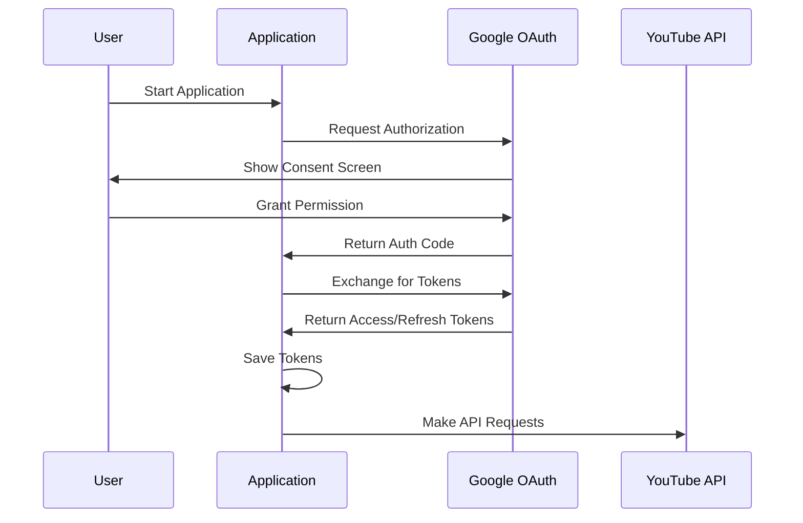
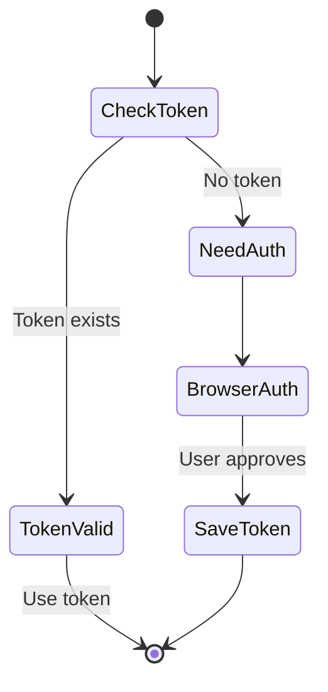
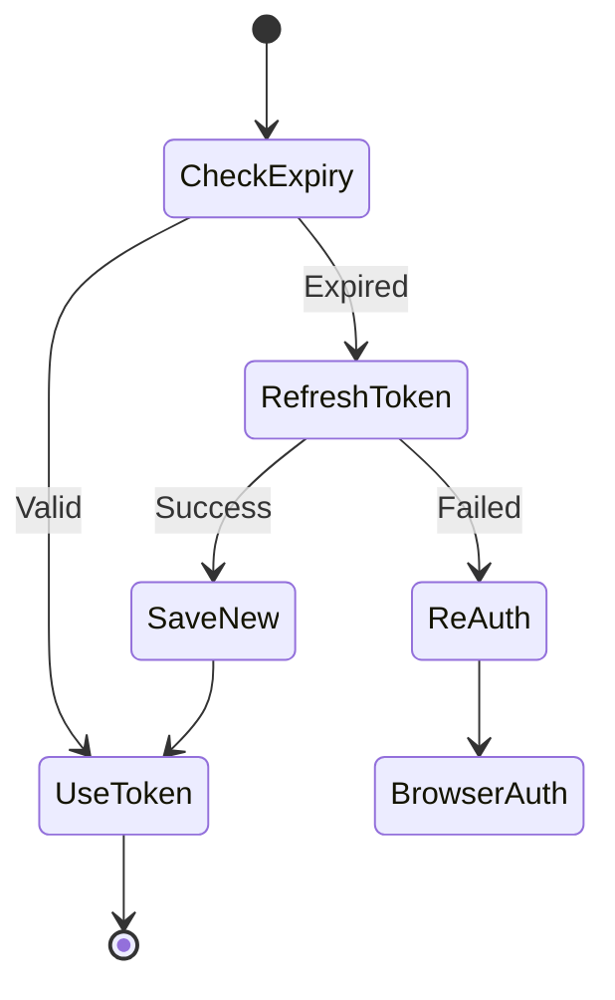

# Authentication Guide

## Table of Contents
- [Overview](#overview)
- [Quick Start](#quick-start)
- [Detailed Setup](#detailed-setup)
- [OAuth2.0 Flow](#oauth20-flow)
- [Token Management](#token-management)
- [Security Best Practices](#security-best-practices)
- [Troubleshooting](#troubleshooting)

## Overview

### Authentication Process


### Required Credentials
1. Google Cloud Project
2. OAuth 2.0 Client ID
3. Client Secret
4. API Key (optional)

## Quick Start

1. **Run the Configuration Command**
```bash
youtube-processor configure
```

2. **Follow the Browser Prompts**
   - Sign in to Google
   - Select your YouTube account
   - Grant requested permissions

3. **Verify Setup**
```bash
youtube-processor verify-auth
```

## Detailed Setup

### 1. Google Cloud Console Setup

1. **Create New Project**
   - Visit [Google Cloud Console](https://console.cloud.google.com)
   - Click "New Project"
   - Enter name: "YouTube Video Automation"
   - Click "Create"

2. **Enable YouTube API**
   - Navigate to "APIs & Services" > "Library"
   - Search for "YouTube Data API v3"
   - Click "Enable"

3. **Configure OAuth Consent Screen**
   - Go to "APIs & Services" > "OAuth consent screen"
   - Select "External" user type
   - Fill in application information:
     ```
     App name: YouTube Video Automation
     User support email: your-email@domain.com
     Developer contact: your-email@domain.com
     ```
   - Add scopes:
     ```
     /auth/youtube.upload
     /auth/youtube
     /auth/youtube.force-ssl
     ```
   - Add test users (for development)

4. **Create OAuth Credentials**
   - Go to "APIs & Services" > "Credentials"
   - Click "Create Credentials" > "OAuth client ID"
   - Choose "Desktop application"
   - Download JSON file
   - Rename to `client_secrets.json`

### 2. Application Setup

1. **Place Credentials**
```bash
mkdir -p config
cp path/to/client_secrets.json config/
```

2. **Configure Environment**
```bash
# .env file
CREDENTIALS_PATH=config/client_secrets.json
TOKEN_PATH=config/token.json
```

## OAuth2.0 Flow

### Initial Authentication


### Token Refresh


## Token Management

### Token Storage
```python
# Default locations
token_path = Path("config/token.json")
credentials_path = Path("config/client_secrets.json")
```

### Token Format
```json
{
    "token": "ya29.a0...",
    "refresh_token": "1//0eX...",
    "token_uri": "https://oauth2.googleapis.com/token",
    "client_id": "YOUR_CLIENT_ID",
    "client_secret": "YOUR_CLIENT_SECRET",
    "scopes": [
        "https://www.googleapis.com/auth/youtube.upload",
        "https://www.googleapis.com/auth/youtube"
    ],
    "expiry": "2024-02-20T12:00:00.000Z"
}
```

### Token Refresh Logic
```python
if token.expired and token.refresh_token:
    try:
        token.refresh(Request())
    except RefreshError:
        # Trigger new authentication
        flow = InstalledAppFlow.from_client_secrets_file(...)
```

## Security Best Practices

### 1. Credential Storage
- Never commit credentials to version control
- Use environment variables when possible
- Secure token storage location

### 2. Token Handling
- Implement token rotation
- Handle refresh token securely
- Clear tokens on logout

### 3. Scope Management
- Request minimal scopes
- Review granted permissions
- Update scopes as needed

### 4. Error Handling
```python
try:
    credentials = flow.run_local_server(
        port=0,
        authorization_prompt_message='Please authorize access',
        success_message='Authorization complete!'
    )
except Exception as e:
    logger.error(f"Authentication failed: {e}")
    raise AuthError(f"Failed to authenticate: {e}")
```

## Troubleshooting

### Common Issues

1. **Invalid Client Secrets**
   ```
   Error: File client_secrets.json is missing or invalid
   ```
   - Verify file location
   - Check file format
   - Re-download from Google Cloud Console

2. **Token Refresh Failed**
   ```
   Error: Token refresh failed
   ```
   - Delete token.json
   - Re-authenticate
   - Check scope changes

3. **Authorization Error**
   ```
   Error: access_denied
   ```
   - Check OAuth consent screen
   - Verify user is added as tester
   - Review requested scopes

### Verification Steps

1. **Check Credentials**
```bash
youtube-processor verify-credentials
```

2. **Test Authentication**
```bash
youtube-processor test-auth
```

3. **View Token Info**
```bash
youtube-processor token-info
```

### Resetting Authentication

1. **Clear Tokens**
```bash
youtube-processor clear-auth
```

2. **Reset All**
```bash
youtube-processor reset-auth --all
```

## API Quotas

### Default Quotas
- Units per day: 10,000
- Uploads per day: 6
- Concurrent uploads: 1

### Quota Management
1. Monitor usage in Google Cloud Console
2. Implement rate limiting
3. Handle quota errors
4. Request quota increase if needed

## Additional Resources

- [Google OAuth2.0 Documentation](https://developers.google.com/identity/protocols/oauth2)
- [YouTube Data API Documentation](https://developers.google.com/youtube/v3)
- [Security Best Practices](docs/security.md)
- [API Reference](docs/api.md)

---

For technical details about implementation, see the [Developer Guide](developer_guide.md).
