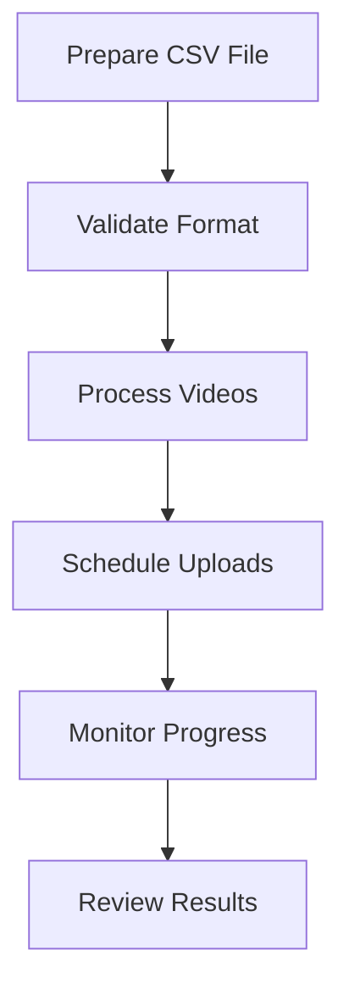

# Batch Processing Guide

## Table of Contents
- [Overview](#overview)
- [Quick Start](#quick-start)
- [CSV Format](#csv-format)
- [Advanced Features](#advanced-features)
- [Channel-Specific Templates](#channel-specific-templates)
- [Best Practices](#best-practices)
- [Scheduling Strategies](#scheduling-strategies)
- [Troubleshooting](#troubleshooting)

## Overview

### What is Batch Processing?
Batch processing allows you to:
- Upload multiple videos at once
- Schedule content in advance
- Maintain consistent metadata
- Automate your workflow

### Process Flow


## Quick Start

### 1. Create Basic CSV
```csv
file_path,title,description,publish_time
videos/vid1.mp4,First Video,Great content!,2024-02-20T15:00:00
videos/vid2.mp4,Second Video,More content!,2024-02-21T15:00:00
```

### 2. Run Batch Process
```bash
youtube-processor batch-process data/batch/my_videos.csv
```

### 3. Monitor Progress
```bash
youtube-processor status
```

## CSV Format

### Required Columns
| Column | Description | Example |
|--------|-------------|---------|
| file_path | Path to video file | videos/vid1.mp4 |
| title | Video title | My Awesome Video |
| description | Video description | Check out this content! |
| publish_time | Schedule time | 2024-02-20T15:00:00 |

### Optional Columns
| Column | Description | Default |
|--------|-------------|---------|
| tags | Comma-separated tags | [] |
| category | YouTube category ID | 22 |
| privacy_status | private/public/unlisted | private |
| made_for_kids | true/false | false |
| language | Language code | en |
| thumbnail_path | Path to thumbnail | null |

### Example CSV
```csv
file_path,title,description,tags,category,privacy_status,thumbnail_path,publish_time
videos/game1.mp4,"Epic Win!","Amazing gameplay!","gaming,walkthrough",20,private,thumbnails/thumb1.jpg,2024-02-20T15:00:00
videos/game2.mp4,"Best Moments","Highlight reel!","gaming,highlights",20,private,thumbnails/thumb2.jpg,2024-02-21T15:00:00
```

## Advanced Features

### 1. Dynamic Field Substitution
Use variables in your CSV:
```csv
title,description
"{game} Gameplay #{episode}","Playing {game}!\n\nEpisode {episode}"
```

```bash
youtube-processor batch-process videos.csv --variables game="Minecraft" episode=1
```

### 2. Metadata Templates
```yaml
# templates/gaming.yaml
base_description: |
  🎮 Playing {game}
  Episode {episode}

  🔔 Subscribe for more content!

  #gaming #{game} #letsplay
```

### 3. Batch Categories
Process different content types:
```bash
youtube-processor batch-process --category gaming gaming.csv
youtube-processor batch-process --category tutorials tutorials.csv
```

## Channel-Specific Templates

### 1. Gaming Channel
```csv
file_path,title,description,tags,category,language
gameplay.mp4,"{game} - Part {part}","🎮 {game} Walkthrough
Part {part}

⏰ Timestamps:
0:00 - Intro
1:30 - Gameplay
10:00 - Boss Fight

🎮 Game: {game}
👾 Platform: {platform}

#gaming #{game} #walkthrough","{game},gaming,walkthrough",20,en
```

### 2. Tutorial Series
```csv
file_path,title,description,tags,category,made_for_kids
tutorial1.mp4,"{topic} Tutorial - Part {part}","📚 {topic} for Beginners
Part {part}

✏️ In this tutorial:
{bullets}

🔗 Resources:
{resources}

#tutorial #{topic} #learning","{topic},tutorial,education",27,false
```

### 3. Vlog Content
```csv
file_path,title,description,tags,category,location
vlog.mp4,"Daily Vlog - {date}","📱 Daily Life as a {profession}

⏰ Timeline:
{timestamps}

🎵 Music:
{music}

#vlog #daily #{profession}","vlog,daily,lifestyle",22,"{coordinates}"
```

## Best Practices

### 1. File Organization
```
project/
├── videos/
│   ├── gaming/
│   ├── tutorials/
│   └── vlogs/
├── thumbnails/
│   ├── gaming/
│   ├── tutorials/
│   └── vlogs/
└── batch/
    ├── gaming.csv
    ├── tutorials.csv
    └── vlogs.csv
```

### 2. Naming Conventions
- Use consistent prefixes
- Include dates in filenames
- Avoid special characters
- Use series identifiers

### 3. Scheduling Strategy
- Space out uploads
- Consider time zones
- Allow processing time
- Plan for holidays

### 4. Quality Control
- Validate CSV before processing
- Test with sample videos
- Monitor upload status
- Review scheduled content

## Scheduling Strategies

### 1. Regular Schedule
```csv
title,publish_time
"Monday Video","{monday}T15:00:00"
"Wednesday Video","{wednesday}T15:00:00"
"Friday Video","{friday}T15:00:00"
```

### 2. Time Zone Management
```bash
youtube-processor batch-process --timezone "America/New_York" videos.csv
```

### 3. Smart Scheduling
```bash
youtube-processor analyze-optimal-times --last-30-days
youtube-processor batch-process --optimize-schedule videos.csv
```

## Troubleshooting

### Common Issues

1. **File Not Found**
```
Error: Could not find file at path/to/video.mp4
```
- Check file paths
- Verify file permissions
- Use absolute paths

2. **Invalid CSV Format**
```
Error: CSV validation failed
```
- Check column names
- Verify date formats
- Look for special characters

3. **Scheduling Conflicts**
```
Error: Upload schedule too dense
```
- Increase time between uploads
- Check processing requirements
- Verify quota limits

### Validation Tools

1. **Check CSV Format**
```bash
youtube-processor validate-csv batch.csv
```

2. **Preview Batch**
```bash
youtube-processor preview-batch batch.csv
```

3. **Estimate Processing Time**
```bash
youtube-processor estimate-time batch.csv
```

## Additional Resources

- [CSV Templates](docs/templates/)
- [Scheduling Guide](docs/scheduling.md)
- [API Quotas](docs/quotas.md)
- [Best Practices](docs/best_practices.md)

---

For more examples and templates, see our [Templates Guide](templates.md).
