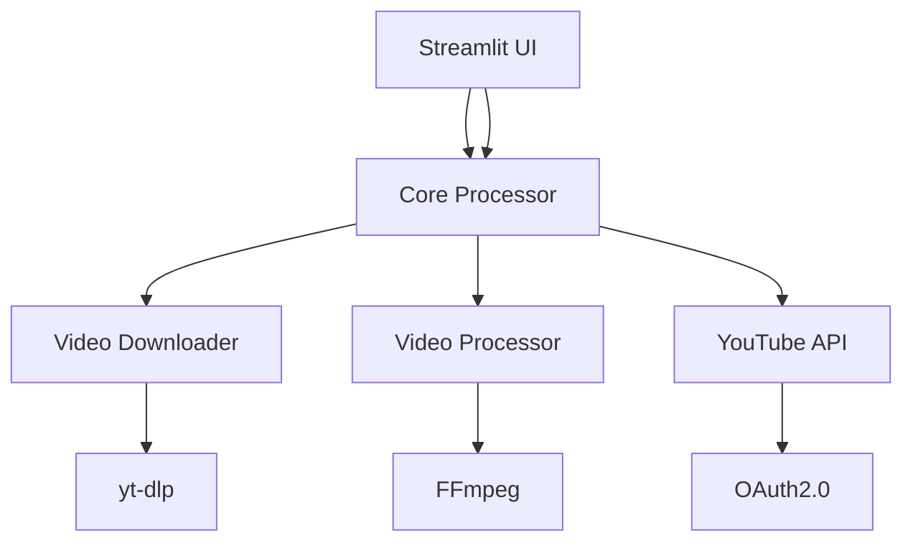

# Developer Guide

## Table of Contents

- [Architecture Overview](#architecture-overview)
- [Development Environment](#development-environment)
- [Project Structure](#project-structure)
- [Core Components](#core-components)
- [API Reference](#api-reference)
- [Testing](#testing)
- [Contributing](#contributing)
- [Release Process](#release-process)

## Architecture Overview

### High-Level Design



### Key Components

1. **Core Processor**: Orchestrates the workflow
2. **Video Downloader**: Handles video acquisition
3. **Video Processor**: Manages FFmpeg operations
4. **YouTube API**: Handles uploads and scheduling
5. **Streamlit UI**: User-friendly interface

### Design Principles

- Clean Architecture
- Separation of Concerns
- Dependency Injection
- Error Handling First
- Configuration as Code

## Development Environment

### Prerequisites

```bash
# Required software
Python 3.9+
FFmpeg
Git
make (optional)

# Optional tools
pre-commit
black
mypy
pytest
```

### Setup

```bash
# Clone repository
git clone https://github.com/dasdatasensei/YouTubeVideoAutomation.git
cd YouTubeVideoAutomation

# Create virtual environment
python -m venv .venv
source .venv/bin/activate  # Windows: .\.venv\Scripts\activate

# Install dependencies
pip install -e ".[dev]"

# Set up pre-commit hooks
pre-commit install
```

### Configuration

```python
# config.py
from pydantic_settings import BaseSettings

class Settings(BaseSettings):
    CREDENTIALS_PATH: Path
    WORK_DIR: Path
    # ... other settings
```

## Project Structure

```
YouTubeVideoAutomation/
├── src/
│   └── youtube_processor/
│       ├── core/               # Core business logic
│       │   ├── downloader.py
│       │   ├── processor.py
│       │   └── youtube_api.py
│       ├── utils/              # Utility functions
│       ├── models.py           # Data models
│       └── cli.py             # CLI interface
├── streamlit_app.py           # Streamlit interface
├── tests/                     # Test suite
├── docs/                      # Documentation
└── scripts/                   # Development scripts
```

## Core Components

### Video Downloader

```python
class VideoDownloader:
    """Handles video downloading using yt-dlp."""

    def download(self, url: str) -> Tuple[Path, VideoMetadata]:
        """Download video and extract metadata."""
```

### Video Processor

```python
class VideoProcessor:
    """Handles video processing using FFmpeg."""

    def process_video(self, input_path: Path) -> Path:
        """Add black screen to video end."""
```

### YouTube API

```python
class YouTubeAPI:
    """Handles YouTube API operations."""

    def upload_video(
        self,
        video_path: Path,
        metadata: VideoMetadata,
        publish_time: Optional[datetime] = None
    ) -> str:
```

## API Reference

### Public APIs

```python
from youtube_processor import YouTubeProcessor

# Initialize processor
processor = YouTubeProcessor(
    client_secrets_file='config/client_secrets.json'
)

# Process video
video_id = processor.process_video(
    url='https://youtube.com/watch?v=example',
    publish_time=datetime.now() + timedelta(days=1)
)
```

### Error Handling

```python
from youtube_processor.exceptions import (
    VideoProcessingError,
    VideoUploadError,
    OAuth2Error
)

try:
    processor.process_video(url)
except VideoProcessingError as e:
    logger.error(f"Processing failed: {e}")
except VideoUploadError as e:
    logger.error(f"Upload failed: {e}")
```

## Testing

### Running Tests

```bash
# Run all tests
pytest

# Run with coverage
pytest --cov=youtube_processor

# Run specific test
pytest tests/test_processor.py
```

### Writing Tests

```python
def test_video_processing():
    processor = VideoProcessor()
    result = processor.process_video(test_video_path)
    assert result.exists()
    assert result.stat().st_size > 0
```

### Mocking

```python
@patch('youtube_processor.core.youtube_api.build')
def test_youtube_api(mock_build):
    mock_build.return_value = Mock()
    api = YouTubeAPI()
    # ... test implementation
```

## Contributing

### Development Workflow

1. Fork repository
2. Create feature branch
3. Implement changes
4. Write tests
5. Update documentation
6. Submit pull request

### Code Style

```bash
# Format code
black src/ tests/

# Sort imports
isort src/ tests/

# Type checking
mypy src/
```

### Pre-commit Hooks

```yaml
# .pre-commit-config.yaml
repos:
  - repo: https://github.com/psf/black
    rev: 22.3.0
    hooks:
      - id: black
```

## Release Process

### Version Bumping

```bash
# Update version
bumpversion patch  # or minor/major

# Build distribution
python -m build

# Upload to PyPI
twine upload dist/*
```

### Release Checklist

1. Update CHANGELOG.md
2. Run full test suite
3. Build documentation
4. Create GitHub release
5. Upload to PyPI
6. Update documentation site

## Advanced Topics

### Custom Extensions

```python
class CustomProcessor(VideoProcessor):
    """Extend video processing capabilities."""

    def process_video(self, input_path: Path) -> Path:
        # Custom implementation
```

### Performance Optimization

- Use async/await for I/O operations
- Implement batch processing
- Cache API responses
- Optimize FFmpeg parameters

### Security Considerations

- Secure credential storage
- Token refresh handling
- Rate limiting
- Error handling

## Troubleshooting

### Common Issues

1. FFmpeg errors
2. OAuth2 token issues
3. API quota limits
4. File permission problems

### Debugging

```python
# Enable debug logging
import logging
logging.basicConfig(level=logging.DEBUG)
```

## Additional Resources

- [API Documentation](docs/api.md)
- [Architecture Details](docs/architecture.md)
- [Contributing Guide](CONTRIBUTING.md)
- [Security Policy](SECURITY.md)

---

For more detailed information about specific components, check the individual documentation files in the `docs/` directory.
