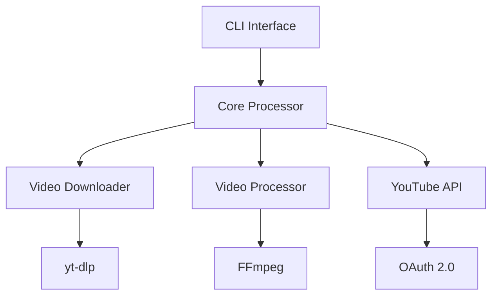
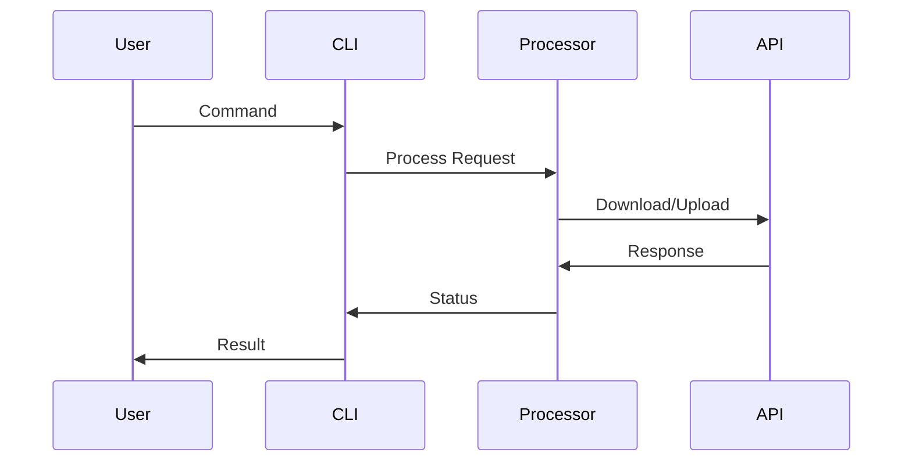

# Development Documentation

## Table of Contents
- [Architecture Overview](#architecture-overview)
- [Development Setup](#development-setup)
- [Testing Guide](#testing-guide)
- [Style Guide](#style-guide)
- [Release Process](#release-process)

## Architecture Overview

### System Architecture


### Core Components

1. **CLI Interface**
   - Command parsing
   - User interaction
   - Progress reporting
   - Error handling

2. **Core Processor**
   - Workflow orchestration
   - State management
   - Error recovery
   - Resource cleanup

3. **Video Handlers**
   - Download management
   - Video processing
   - Upload handling
   - Metadata management

### Data Flow


### Directory Structure
```
youtube_processor/
├── cli.py            # Command-line interface
├── config.py         # Configuration management
├── core/
│   ├── downloader.py # Video downloading
│   ├── processor.py  # Video processing
│   └── youtube_api.py# YouTube API handling
├── models.py         # Data models
└── utils/            # Utility functions
```

## Development Setup

### Prerequisites
```bash
# Required software
python >= 3.9
ffmpeg >= 4.4
git

# Optional tools
docker
make
```

### Environment Setup
```bash
# Clone repository
git clone https://github.com/yourusername/youtube-automation.git
cd youtube-automation

# Create virtual environment
python -m venv .venv
source .venv/bin/activate  # Windows: .\.venv\Scripts\activate

# Install dependencies
pip install -e ".[dev]"

# Set up pre-commit hooks
pre-commit install
```

### Development Tools
```bash
# Code formatting
black src/ tests/
isort src/ tests/

# Type checking
mypy src/

# Linting
pylint src/

# Running tests
pytest tests/
```

## Testing Guide

### Test Structure
```
tests/
├── conftest.py          # Shared fixtures
├── test_cli.py          # CLI tests
├── test_processor.py    # Core processor tests
└── integration/         # Integration tests
```

### Writing Tests

#### Unit Tests
```python
def test_video_processing():
    """Test video processing functionality."""
    processor = VideoProcessor()
    result = processor.process_video(test_video_path)

    assert result.exists()
    assert result.stat().st_size > 0
```

#### Integration Tests
```python
@pytest.mark.integration
def test_end_to_end():
    """Test complete processing pipeline."""
    processor = YouTubeProcessor()
    video_id = processor.process_video(
        url="https://youtube.com/watch?v=test",
        publish_time=datetime.now()
    )

    assert video_id is not None
```

### Test Configuration
```python
# conftest.py
@pytest.fixture
def test_video():
    """Provide test video file."""
    video_path = create_test_video()
    yield video_path
    video_path.unlink()

@pytest.fixture
def mock_youtube_api():
    """Mock YouTube API responses."""
    with patch('youtube_processor.core.youtube_api.build') as mock:
        yield mock
```

### Running Tests
```bash
# Run all tests
pytest

# Run with coverage
pytest --cov=youtube_processor

# Run specific test file
pytest tests/test_processor.py

# Run marked tests
pytest -m "integration"
```

## Style Guide

### Code Style

#### Python Style
```python
# Good
def process_video(
    self,
    input_path: Path,
    options: Optional[Dict[str, Any]] = None
) -> Path:
    """
    Process video with given options.

    Args:
        input_path: Path to input video
        options: Processing options

    Returns:
        Path to processed video
    """
    if not input_path.exists():
        raise FileNotFoundError(f"Video not found: {input_path}")

    return self._process(input_path, options or {})

# Bad
def process_video(self, input_path, options=None):
    if not input_path.exists():
        raise FileNotFoundError(f"Video not found: {input_path}")
    return self._process(input_path, options if options else {})
```

#### Documentation Style
```python
"""
Module docstring with brief description.

Detailed description of module functionality,
usage examples, and important notes.
"""

from typing import Optional, Dict, Any
from pathlib import Path

class ExampleClass:
    """
    Class docstring with brief description.

    Detailed description of class purpose and usage.

    Attributes:
        attribute_name: Description of attribute

    Example:
        ```python
        instance = ExampleClass()
        result = instance.method()
        ```
    """
```

### Git Workflow

#### Commit Messages
```
feat: Add video processing feature
^--^  ^----------------------^
|     |
|     +-> Summary in present tense
|
+-------> Type: feat, fix, docs, style, refactor, test, chore
```

#### Branch Naming
```
feature/add-video-processing
bugfix/fix-upload-error
docs/update-readme
```

## Release Process

### Version Numbering
```
MAJOR.MINOR.PATCH
  ^    ^     ^
  |    |     |
  |    |     +-> Bug fixes
  |    +--------> New features (backwards compatible)
  +-------------> Breaking changes
```

### Release Steps

1. **Prepare Release**
```bash
# Update version
bump2version patch  # or minor/major

# Update changelog
changelog-generator

# Create release branch
git checkout -b release/v1.0.0
```

2. **Test Release**
```bash
# Run full test suite
pytest

# Build distribution
python -m build

# Test installation
pip install dist/*.whl
```

3. **Release**
```bash
# Create tag
git tag -a v1.0.0 -m "Release v1.0.0"

# Push to GitHub
git push origin v1.0.0

# Upload to PyPI
twine upload dist/*
```

### Release Checklist
- [ ] All tests passing
- [ ] Documentation updated
- [ ] Changelog updated
- [ ] Version bumped
- [ ] Release notes written
- [ ] Distribution built and tested
- [ ] Tag created and pushed
- [ ] PyPI upload successful

## Additional Resources

### Documentation
- [API Reference](../api/README.md)
- [Configuration Guide](../config/README.md)
- [Contributing Guide](../CONTRIBUTING.md)

### Tools
- [Development Tools](tools.md)
- [CI/CD Pipeline](ci_cd.md)
- [Code Quality Tools](code_quality.md)

### References
- [Python Style Guide](https://peps.python.org/pep-0008/)
- [Type Hints Guide](https://peps.python.org/pep-0484/)
- [Documentation Guide](https://peps.python.org/pep-0257/)
